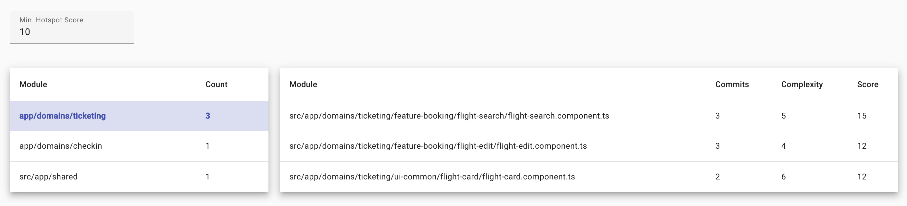

# Detective

Visualize and Analyze your TypeScript-based Architecture!

Detective leverages forensic code analysis at the architectural level to uncover hidden patterns in your codebase.

## Features

### Visualize Your Project Structure 

Gain an overview of your modules, domains, and layers:


### Analyze Change Coupling 

The Change Coupling analysis reveals which modules have often been changed together, indicating a non-obvious type of coupling.


### Analyze Team/Code Alignment 

The Team Alignment Analysis shows whether your team structure and module/domain boundaries are aligned:


### Analyze Hotspots 

The Team Alignment Analysis shows whether your team structure and module/domain boundaries are aligned:



## Using

You can try it out quickly by running Detective in your project's **root** directory:

```shell
npm i @softarc/detective -D
npx detective
```

## Defining Teams

For the Team Alignment Analysis, you need to map team names to the names of your team members as found in ``git log``. This is done in the file `.detective/config.json` created the first time detective runs:

```json
{
  [...].
  "teams": {
    "alpha": ["John Doe", "Jane Doe"],
    "beta": ["Max Muster", "Susi Sorglos"]
  }
}
```

## Nx Support

Detective works with all TypeScript projects. If it's executed within an [Nx](https://nx.dev/) project, it will use typical Nx patterns to retrieve the entry points into your apps and libs.

## Credits

Detective stand on the shoulders of giants:

- Inspired by the [Nx Dependency Graph](https://nx.dev/).
- Inspired by [Adam Tornhill's](https://x.com/AdamTornhill) book [Your Code as a Crime Scene, Second Edition](https://pragprog.com/titles/atcrime2/your-code-as-a-crime-scene-second-edition/)
- Powered by [Rainer Hahnekamp's](https://x.com/rainerhahnekamp) awesome and high-quality work on our open source project [Sheriff](https://softarc-consulting.github.io/sheriff/)

<h2>More on Architecture</h2>
  <div class="book">
    <h3>Free eBook: Enterprise Angular</h3>
    <p>
      <a 
        href="https://www.angulararchitects.io/en/ebooks/micro-frontends-and-moduliths-with-angular/"
      >
        
      </a>
    </p>
    <p>
      <a
        href="https://www.angulararchitects.io/en/ebooks/micro-frontends-and-moduliths-with-angular/"
        >Download Here!</a
      >
    </p>
  </div>
  <div class="workshop">
    <h3>Angular Architecture Workshop</h3>
    <p>
      <a
        href="https://www.angulararchitects.io/en/training/advanced-angular-architecture-workshop/"
      >
        
      </a>
    </p>
    <p>
      <a
        href="https://www.angulararchitects.io/en/training/advanced-angular-architecture-workshop/"
        >All Details & Tickets!</a
      >
    </p>
  </div>

## More

If you like the idea of forensic code analysis, you'll love [Adam Tornhill's](https://x.com/AdamTornhill) product [Code Scene](https://codescene.com/) that goes far beyond the scope of Detective.